<!-- # Deep Neural Mel-Subband Beamformer for In-Car Speech Separation -->

<!-- ### *Vinay Kothapally, Yong Xu, Meng Yu, Shi-Xiong Zhang, Dong Yu* -->
### [SUBMITTED TO ICASSP 2023]

<h2 id = "1"><u>Abstract</u></h2>

While current deep learning (DL)-based beamforming techniques have been proved effective in speech separation, they are often designed to process narrow-band (NB) frequencies independently which results in higher computational costs and inference times, making them unsuitable for real-world use. In this paper, we propose DL-based mel-subband spatio-temporal beamformer to perform speech separation in a car environment with reduced computation cost and inference time. As opposed to conventional subband (SB) approaches, our framework uses a mel-scale based subband selection strategy which ensures a fine-grained processing for lower frequencies where most speech formant structure is present, and coarse-grained processing for higher frequencies. In a recursive way, robust frame-level beamforming weights are determined for each speaker location/zone in a car from the estimated subband speech and noise covariance matrices. Furthermore, proposed framework also estimates and suppresses any echoes from the loudspeaker(s) by using the echo reference signals. We compare the performance of our proposed framework to several NB, SB, and full-band (FB) processing techniques in terms of speech quality and recognition metrics. Based on experimental evaluations on simulated and real-world recordings, we find that our proposed framework achieves better separation performance over all SB and FB approaches and achieves performance closer to NB processing techniques while requiring lower computing cost.

<!-- ## Problem Statement

| **M-Microphone N-Speaker Separation with Low Computations and Faster Inference**                    |                                                              | 
| :----------------------------------------------------------: | :----------------------------------------------------------: |
|  | While current deep learning (DL)-based beamforming techniques have been proved effective in speech separation, they are often designed to process narrow-band (NB) frequencies independently which results in higher computational costs and inference times, making them unsuitable for real-world use. In this paper, we propose DL-based mel-subband spatio-temporal beamformer to perform speech separation in a car environment with reduced computation cost and inference time. As opposed to conventional subband (SB) approaches, our framework uses a mel-scale based subband selection strategy which ensures a fine-grained processing for lower frequencies where most speech formant structure is present | -->

<h2 id = "1"><u>Problem Statement</u></h2>

### [M-Microphone N-Speaker Separation with Low Computations and Faster Inference]
 

While current deep learning (DL)-based beamforming techniques have been proved effective in speech separation, they are often designed to process narrow-band (NB) frequencies independently which results in higher computational costs and inference times, making them unsuitable for real-world use. In this paper, we propose DL-based mel-subband spatio-temporal beamformer to perform speech separation in a car environment with reduced computation cost and inference time. As opposed to conventional subband (SB) approaches, our framework uses a mel-scale based subband selection strategy which ensures a fine-grained processing for lower frequencies where most speech formant structure is present 

    

<!-- <h2 id = "1"><u>Real-World Recording Setup for In-Car Speech Capture</u></h2>

|  |  |  |  | -->

<h2 id = "1"><u>Proposed Subband Beamforming -- All Neural Network Architecture</u></h2>

|  **Neural Architecture**                                     |
| :----------------------------------------------------------: |
|  |

|  **Tensor Dimensions for each step within the Network**      |
| :----------------------------------------------------------: |
|  |

    

<h2 id = "1"><u>Audio samples processed by various DL-based beamformers</u></h2>

### [Includes Narrow-band (NB), Full-band (FB), and Sub-band (SB) based approaches]

|       **Audio sample illustrated in the  paper**             |                                                              |                                                              |                                                              |
| :----------------------------------------------------------: | :----------------------------------------------------------: | :----------------------------------------------------------: | :----------------------------------------------------------: |
| **Mixture**  <audio controls><source src="./data/with_reverb/example275/noisy.wav" type="audio/wav">Your browser does not support the audio element.</audio> | **ConvTasNet (FB)**    <audio controls><source src="./data/with_reverb/example275/fullsubnet+.wav" type="audio/wav">Your browser does not support the audio element.</audio> | **LSTM+Attention (FB)**  <audio controls><source src="./data/with_reverb/example275/noisy.wav" type="audio/wav">Your browser does not support the audio element.</audio> | **GRNNBF (FB)**    <audio controls><source src="./data/with_reverb/example275/fullsubnet+.wav" type="audio/wav">Your browser does not support the audio element.</audio> |
|  <strong>PESQ: 4.50  &nbsp;&nbsp; SiSNR: +Inf |  <strong>PESQ: 4.50  &nbsp;&nbsp; SiSNR: +Inf |  <strong>PESQ: 4.50  &nbsp;&nbsp; SiSNR: +Inf |  <strong>PESQ: 4.50  &nbsp;&nbsp; SiSNR: +Inf |
| **Tradition Subband (#64)**   <audio controls><source src="./data/with_reverb/example275/fullsubnet++.wav" type="audio/wav">Your browser does not support the audio element.</audio> | **Proposed Mel-Subband (#64)**   <audio controls><source src="./data/with_reverb/example275/clean.wav" type="audio/wav">Your browser does not support the audio element.</audio> | **Time-Variant MVDR (NB)**   <audio controls><source src="./data/with_reverb/example275/fullsubnet++.wav" type="audio/wav">Your browser does not support the audio element.</audio> | **GRNNBF (NB)**   <audio controls><source src="./data/with_reverb/example275/clean.wav" type="audio/wav">Your browser does not support the audio element.</audio> |
|  <strong>PESQ: 4.50  &nbsp;&nbsp; SiSNR: +Inf |  <strong>PESQ: 4.50  &nbsp;&nbsp; SiSNR: +Inf |  <strong>PESQ: 4.50  &nbsp;&nbsp; SiSNR: +Inf |  <strong>PESQ: 4.50  &nbsp;&nbsp; SiSNR: +Inf |
| **[Reference Rev. Clean] Speaker-1 (In Zone-1)**   <audio controls><source src="./data/with_reverb/example275/fullsubnet++.wav" type="audio/wav">Your browser does not support the audio element.</audio> | **Speaker-2 (In Zone-2)**   <audio controls><source src="./data/with_reverb/example275/clean.wav" type="audio/wav">Your browser does not support the audio element.</audio> | **Speaker-3 (In Zone-3)**   <audio controls><source src="./data/with_reverb/example275/fullsubnet++.wav" type="audio/wav">Your browser does not support the audio element.</audio> | **Speaker-4 (In Zone-4)**   <audio controls><source src="./data/with_reverb/example275/clean.wav" type="audio/wav">Your browser does not support the audio element.</audio> |
|  <strong>PESQ: 4.50  &nbsp;&nbsp; SiSNR: +Inf |  <strong>PESQ: 4.50  &nbsp;&nbsp; SiSNR: +Inf |  <strong>PESQ: 4.50  &nbsp;&nbsp; SiSNR: +Inf |  <strong>PESQ: 4.50  &nbsp;&nbsp; SiSNR: +Inf |

    

<h2 id = "1"><u>Processed Audio Samples of Simulated Recordings (Test Set)</u></h2>

|       **One Speaker present in Car [S1]**                    |   **Mixture SNR: -1.098 dB, PESQ: 1.449**                    |                                                              |                                                              |
| :----------------------------------------------------------: | :----------------------------------------------------------: | :----------------------------------------------------------: | :----------------------------------------------------------: |
| **Mixture**  <audio controls><source src="./data/audiofiles/1spk/mix_1.wav" type="audio/wav">Your browser does not support the audio element.</audio> | **ConvTasNet (FB)**    <audio controls><source src="./data/audiofiles/1spk/ConvTasNet_Zone1_1.wav" type="audio/wav">Your browser does not support the audio element.</audio> | **LSTM+Attention (FB)**  <audio controls><source src="./data/audiofiles/1spk/LSTM_Zone1_1.wav" type="audio/wav">Your browser does not support the audio element.</audio> | **GRNNBF (FB)**    <audio controls><source src="./data/audiofiles/1spk/FB_GRNNBF_Zone1_1.wav" type="audio/wav">Your browser does not support the audio element.</audio> |
| 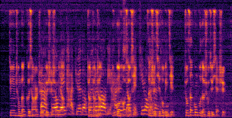 <strong>PESQ: 1.449  &nbsp;&nbsp; SiSNR: -01.098 dB<strong> | 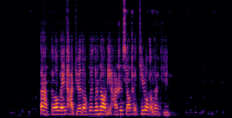 <strong>PESQ: 3.081  &nbsp;&nbsp; SiSNR: 15.017 dB | 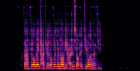 <strong>PESQ: 2.860  &nbsp;&nbsp; SiSNR: 13.979 dB | 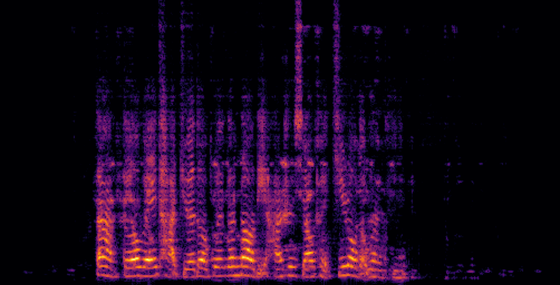 <strong>PESQ: 2.829  &nbsp;&nbsp; SiSNR: 14.163 dB |
| **Tradition Subband (#64)**   <audio controls><source src="./data/audiofiles/1spk/SB_64_Zone1_1.wav" type="audio/wav">Your browser does not support the audio element.</audio> | **Proposed Mel-Subband (#64)**   <audio controls><source src="./data/audiofiles/1spk/MelSB_64_Zone1_1.wav" type="audio/wav">Your browser does not support the audio element.</audio> | **Time-Variant MVDR (NB)**   <audio controls><source src="./data/audiofiles/1spk/MVDR_Zone1_1.wav" type="audio/wav">Your browser does not support the audio element.</audio> | **GRNNBF (NB)**   <audio controls><source src="./data/audiofiles/1spk/NB_GRNNBF_Zone1_1.wav" type="audio/wav">Your browser does not support the audio element.</audio> |
| 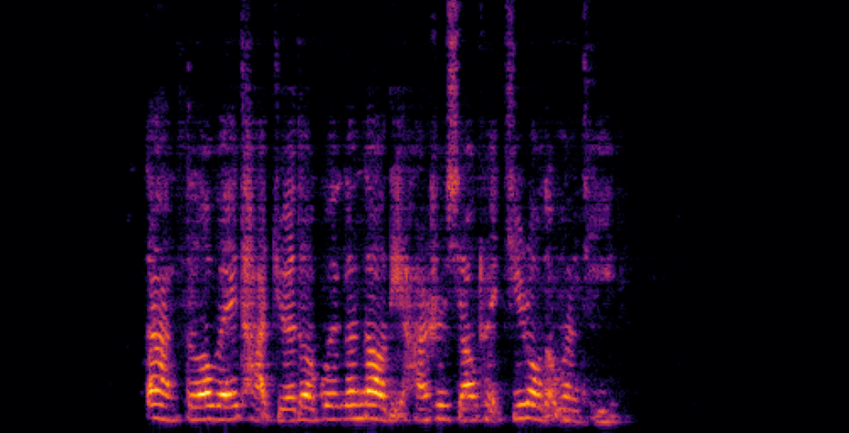 <strong>PESQ: 3.365  &nbsp;&nbsp; SiSNR: 17.102 dB |  <strong>PESQ: 3.504  &nbsp;&nbsp; SiSNR: 18.106 dB | 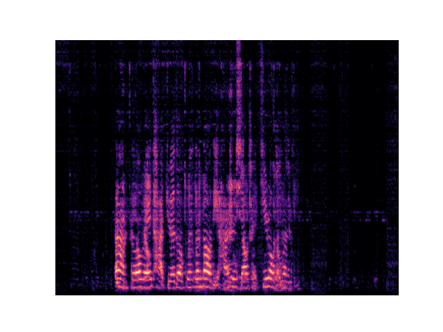 <strong>PESQ: 2.558  &nbsp;&nbsp; SiSNR: 11.431 dB | 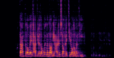 <strong>PESQ: 3.641  &nbsp;&nbsp; SiSNR: 20.198 dB |
| **[Reference Rev. Clean] Speaker-1 (In Zone-1)**   <audio controls><source src="./data/audiofiles/1spk/Ref_Zone1_1.wav" type="audio/wav">Your browser does not support the audio element.</audio> | **Speaker-2 (In Zone-2)**   <audio controls><source src="./data/audiofiles/1spk/Ref_Zone2_1.wav" type="audio/wav">Your browser does not support the audio element.</audio> | **Speaker-3 (In Zone-3)**   <audio controls><source src="./data/audiofiles/1spk/Ref_Zone3_1.wav" type="audio/wav">Your browser does not support the audio element.</audio> | **Speaker-4 (In Zone-4)**   <audio controls><source src="./data/audiofiles/1spk/Ref_Zone4_1.wav" type="audio/wav">Your browser does not support the audio element.</audio> |
| 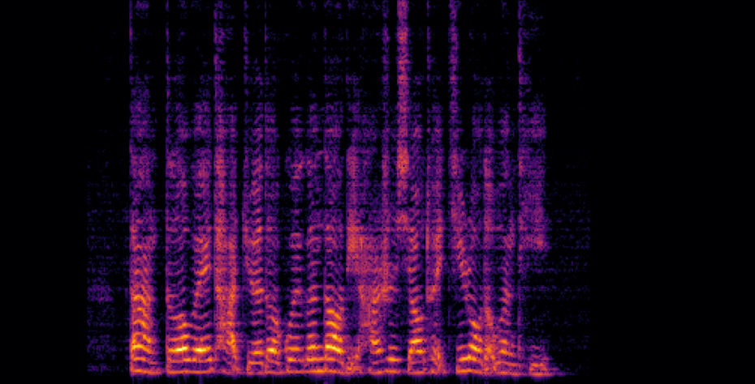 <strong>PESQ: 4.50  &nbsp;&nbsp; SiSNR: +Inf |  <strong>PESQ: 4.50  &nbsp;&nbsp; SiSNR: +Inf |  <strong>PESQ: 4.50  &nbsp;&nbsp; SiSNR: +Inf |  <strong>PESQ: 4.50  &nbsp;&nbsp; SiSNR: +Inf |
    

<!-- |       **One Speaker present in Car [S1]**                    |   **Mixture SNR: -4.362 dB, PESQ: 1.728**                    |                                                              |                                                              |
| :----------------------------------------------------------: | :----------------------------------------------------------: | :----------------------------------------------------------: | :----------------------------------------------------------: |
| **Mixture**  <audio controls><source src="./data/audiofiles/1spk/mix_2.wav" type="audio/wav">Your browser does not support the audio element.</audio> | **ConvTasNet (FB)**    <audio controls><source src="./data/audiofiles/1spk/ConvTasNet_Zone1_2.wav" type="audio/wav">Your browser does not support the audio element.</audio> | **LSTM+Attention (FB)**  <audio controls><source src="./data/audiofiles/1spk/LSTM_Zone1_2.wav" type="audio/wav">Your browser does not support the audio element.</audio> | **GRNNBF (FB)**    <audio controls><source src="./data/audiofiles/1spk/FB_GRNNBF_Zone1_2.wav" type="audio/wav">Your browser does not support the audio element.</audio> |
| 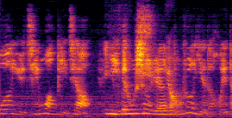 <strong>PESQ: 1.728  &nbsp;&nbsp; SiSNR: -04.362 dB<strong> |  <strong>PESQ: 2.538  &nbsp;&nbsp; SiSNR: 9.671 dB | 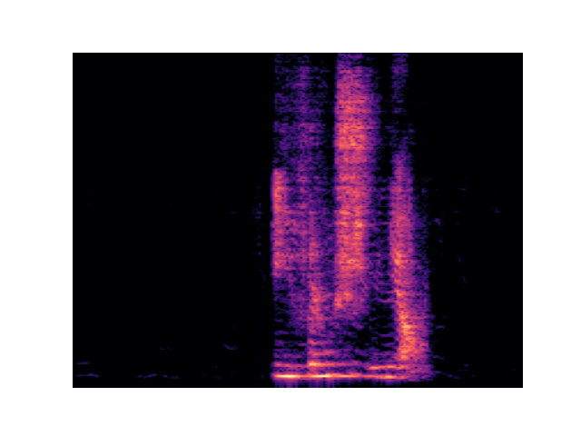 <strong>PESQ: 2.461  &nbsp;&nbsp; SiSNR: 8.592 dB | 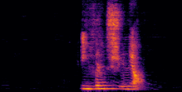 <strong>PESQ: 2.565  &nbsp;&nbsp; SiSNR: 9.550 dB |
| **Tradition Subband (#64)**   <audio controls><source src="./data/audiofiles/1spk/SB_64_Zone1_2.wav" type="audio/wav">Your browser does not support the audio element.</audio> | **Proposed Mel-Subband (#64)**   <audio controls><source src="./data/audiofiles/1spk/MelSB_64_Zone1_2.wav" type="audio/wav">Your browser does not support the audio element.</audio> | **Time-Variant MVDR (NB)**   <audio controls><source src="./data/audiofiles/1spk/MVDR_Zone1_2.wav" type="audio/wav">Your browser does not support the audio element.</audio> | **GRNNBF (NB)**   <audio controls><source src="./data/audiofiles/1spk/NB_GRNNBF_Zone1_2.wav" type="audio/wav">Your browser does not support the audio element.</audio> |
| 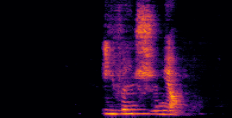 <strong>PESQ: 2.940  &nbsp;&nbsp; SiSNR: 11.252 dB | 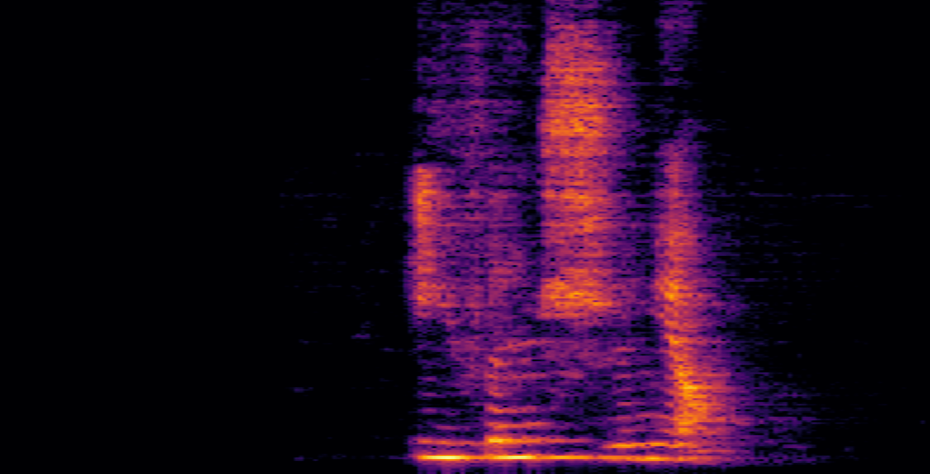 <strong>PESQ: 3.428  &nbsp;&nbsp; SiSNR: 11.258 dB | 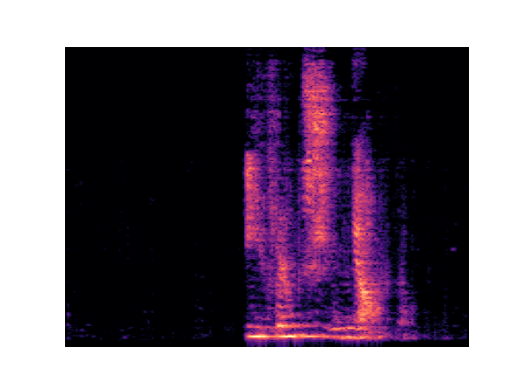 <strong>PESQ: 2.277  &nbsp;&nbsp; SiSNR: 6.891 dB | 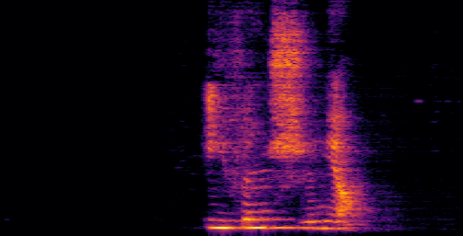 <strong>PESQ: 3.429  &nbsp;&nbsp; SiSNR: 13.811 dB |
| **[Reference Rev. Clean] Speaker-1 (In Zone-1)**   <audio controls><source src="./data/audiofiles/1spk/Ref_Zone1_2.wav" type="audio/wav">Your browser does not support the audio element.</audio> | **Speaker-2 (In Zone-2)**   <audio controls><source src="./data/audiofiles/1spk/Ref_Zone2_2.wav" type="audio/wav">Your browser does not support the audio element.</audio> | **Speaker-3 (In Zone-3)**   <audio controls><source src="./data/audiofiles/1spk/Ref_Zone3_2.wav" type="audio/wav">Your browser does not support the audio element.</audio> | **Speaker-4 (In Zone-4)**   <audio controls><source src="./data/audiofiles/1spk/Ref_Zone4_2.wav" type="audio/wav">Your browser does not support the audio element.</audio> |
| 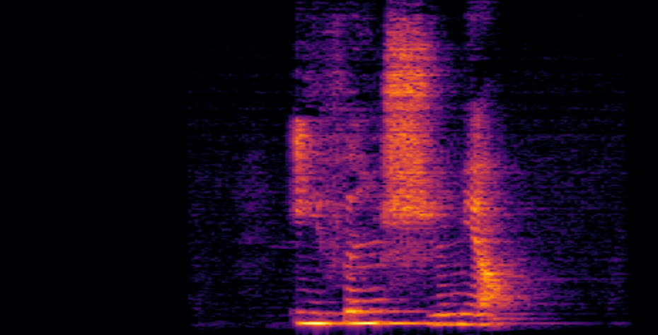 <strong>PESQ: 4.50  &nbsp;&nbsp; SiSNR: +Inf |  <strong>PESQ: 4.50  &nbsp;&nbsp; SiSNR: +Inf |  <strong>PESQ: 4.50  &nbsp;&nbsp; SiSNR: +Inf |  <strong>PESQ: 4.50  &nbsp;&nbsp; SiSNR: +Inf |
    

|       **One Speaker present in Car [S1]**                    |   **Mixture SNR: -8.419 dB, PESQ: 1.657**                    |                                                              |                                                              |
| :----------------------------------------------------------: | :----------------------------------------------------------: | :----------------------------------------------------------: | :----------------------------------------------------------: |
| **Mixture**  <audio controls><source src="./data/audiofiles/1spk/mix_3.wav" type="audio/wav">Your browser does not support the audio element.</audio> | **ConvTasNet (FB)**    <audio controls><source src="./data/audiofiles/1spk/ConvTasNet_Zone1_3.wav" type="audio/wav">Your browser does not support the audio element.</audio> | **LSTM+Attention (FB)**  <audio controls><source src="./data/audiofiles/1spk/LSTM_Zone1_3.wav" type="audio/wav">Your browser does not support the audio element.</audio> | **GRNNBF (FB)**    <audio controls><source src="./data/audiofiles/1spk/FB_GRNNBF_Zone1_3.wav" type="audio/wav">Your browser does not support the audio element.</audio> |
| 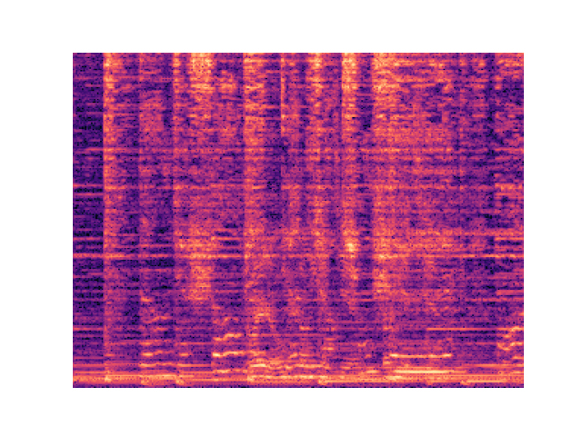 <strong>PESQ: 1.657  &nbsp;&nbsp; SiSNR: -08.419 dB<strong> | 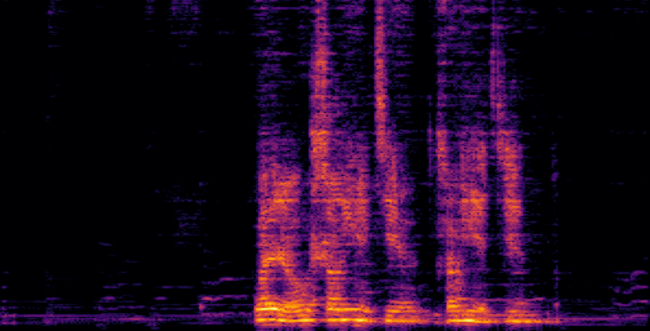 <strong>PESQ: 2.363  &nbsp;&nbsp; SiSNR: 5.199 dB | 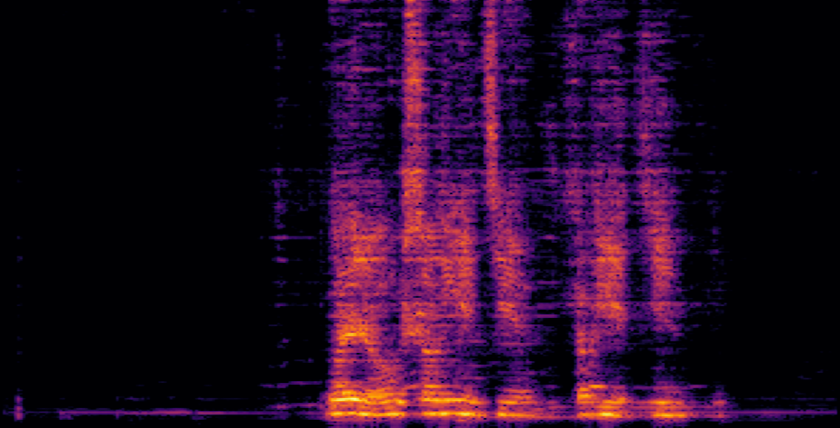 <strong>PESQ: 2.256  &nbsp;&nbsp; SiSNR: 3.799 dB | 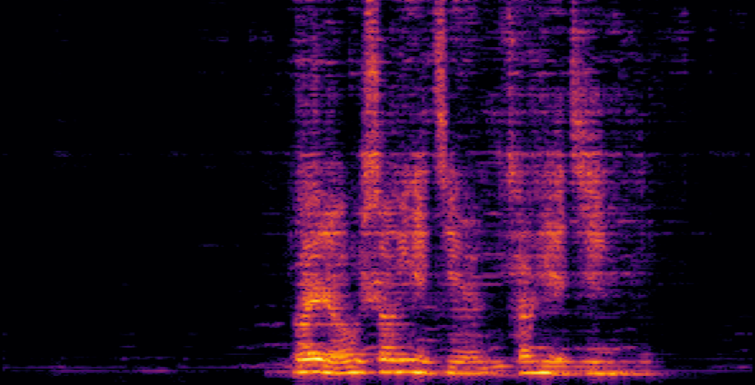 <strong>PESQ: 2.283  &nbsp;&nbsp; SiSNR: 4.513 dB |
| **Tradition Subband (#64)**   <audio controls><source src="./data/audiofiles/1spk/SB_64_Zone1_3.wav" type="audio/wav">Your browser does not support the audio element.</audio> | **Proposed Mel-Subband (#64)**   <audio controls><source src="./data/audiofiles/1spk/MelSB_64_Zone1_3.wav" type="audio/wav">Your browser does not support the audio element.</audio> | **Time-Variant MVDR (NB)**   <audio controls><source src="./data/audiofiles/1spk/MVDR_Zone1_3.wav" type="audio/wav">Your browser does not support the audio element.</audio> | **GRNNBF (NB)**   <audio controls><source src="./data/audiofiles/1spk/NB_GRNNBF_Zone1_3.wav" type="audio/wav">Your browser does not support the audio element.</audio> |
| 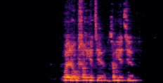 <strong>PESQ: 2.657  &nbsp;&nbsp; SiSNR: 6.363 dB | 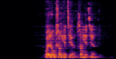 <strong>PESQ: 2.794  &nbsp;&nbsp; SiSNR: 7.473 dB | 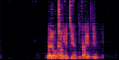 <strong>PESQ: 1.841  &nbsp;&nbsp; SiSNR: 0.242 dB | 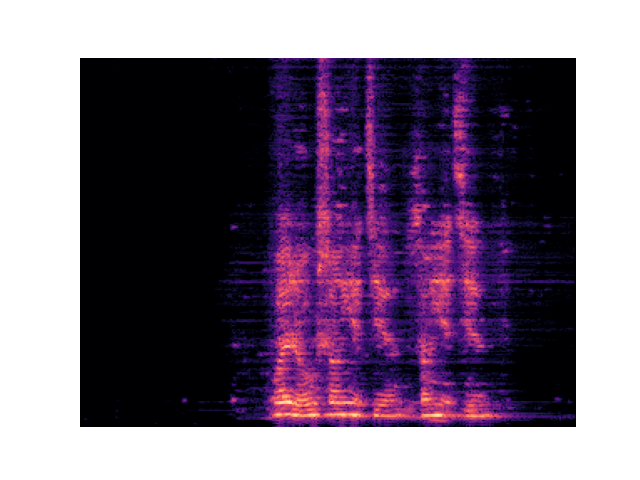 <strong>PESQ: 2.817  &nbsp;&nbsp; SiSNR: 8.459 dB |
| **[Reference Rev. Clean] Speaker-1 (In Zone-1)**   <audio controls><source src="./data/audiofiles/1spk/Ref_Zone1_3.wav" type="audio/wav">Your browser does not support the audio element.</audio> | **Speaker-2 (In Zone-2)**   <audio controls><source src="./data/audiofiles/1spk/Ref_Zone2_3.wav" type="audio/wav">Your browser does not support the audio element.</audio> | **Speaker-3 (In Zone-3)**   <audio controls><source src="./data/audiofiles/1spk/Ref_Zone3_3.wav" type="audio/wav">Your browser does not support the audio element.</audio> | **Speaker-4 (In Zone-4)**   <audio controls><source src="./data/audiofiles/1spk/Ref_Zone4_3.wav" type="audio/wav">Your browser does not support the audio element.</audio> |
| 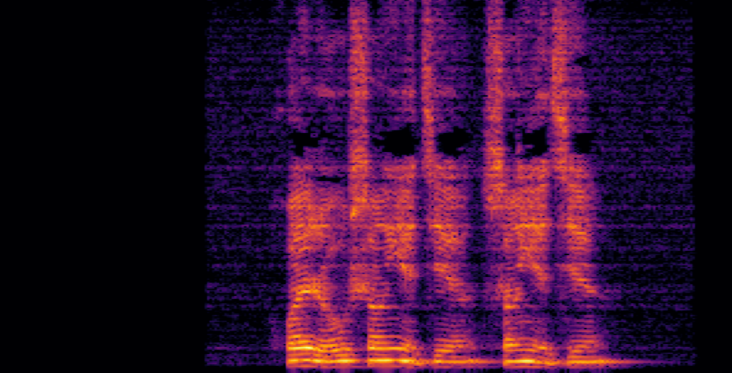 <strong>PESQ: 4.50  &nbsp;&nbsp; SiSNR: +Inf |  <strong>PESQ: 4.50  &nbsp;&nbsp; SiSNR: +Inf |  <strong>PESQ: 4.50  &nbsp;&nbsp; SiSNR: +Inf |  <strong>PESQ: 4.50  &nbsp;&nbsp; SiSNR: +Inf |
     -->

<!-- Three Speakers -->

<!-- |       **Three Speakers present in Car [S1,S2,S3]**           |   **Mixture SNR: -8.419 dB, PESQ: 1.657**                    |                                                              |                                                              |
| :----------------------------------------------------------: | :----------------------------------------------------------: | :----------------------------------------------------------: | :----------------------------------------------------------: |
| **Mixture**  <audio controls><source src="./data/audiofiles/3spk/mix_1.wav" type="audio/wav">Your browser does not support the audio element.</audio> | **ConvTasNet (FB)**    <audio controls><source src="./data/audiofiles/3spk/ConvTasNet_Zone1_1.wav" type="audio/wav">Your browser does not support the audio element.</audio> | **LSTM+Attention (FB)**  <audio controls><source src="./data/audiofiles/3spk/LSTM_Zone1_1.wav" type="audio/wav">Your browser does not support the audio element.</audio> | **GRNNBF (FB)**    <audio controls><source src="./data/audiofiles/3spk/FB_GRNNBF_Zone1_1.wav" type="audio/wav">Your browser does not support the audio element.</audio> |
|  <strong>PESQ: 1.449  &nbsp;&nbsp; SiSNR: -01.098 dB<strong> |  <strong>PESQ: 3.081  &nbsp;&nbsp; SiSNR: 15.017 dB |  <strong>PESQ: 2.860  &nbsp;&nbsp; SiSNR: 13.979 dB |  <strong>PESQ: 2.829  &nbsp;&nbsp; SiSNR: 14.163 dB |
| **Tradition Subband (#64)**   <audio controls><source src="./data/audiofiles/3spk/SB_64_Zone1_1.wav" type="audio/wav">Your browser does not support the audio element.</audio> | **Proposed Mel-Subband (#64)**   <audio controls><source src="./data/audiofiles/3spk/MelSB_64_Zone1_1.wav" type="audio/wav">Your browser does not support the audio element.</audio> | **Time-Variant MVDR (NB)**   <audio controls><source src="./data/audiofiles/3spk/MVDR_Zone1_1.wav" type="audio/wav">Your browser does not support the audio element.</audio> | **GRNNBF (NB)**   <audio controls><source src="./data/audiofiles/3spk/NB_GRNNBF_Zone1_1.wav" type="audio/wav">Your browser does not support the audio element.</audio> |
|  <strong>PESQ: 3.365  &nbsp;&nbsp; SiSNR: 17.102 dB |  <strong>PESQ: 3.504  &nbsp;&nbsp; SiSNR: 18.106 dB |  <strong>PESQ: 2.558  &nbsp;&nbsp; SiSNR: 11.431 dB |  <strong>PESQ: 3.641  &nbsp;&nbsp; SiSNR: 20.198 dB |
| **[Reference Rev. Clean] Speaker-1 (In Zone-1)**   <audio controls><source src="./data/audiofiles/3spk/Ref_Zone1_1.wav" type="audio/wav">Your browser does not support the audio element.</audio> | **Speaker-2 (In Zone-2)**   <audio controls><source src="./data/audiofiles/3spk/Ref_Zone2_1.wav" type="audio/wav">Your browser does not support the audio element.</audio> | **Speaker-3 (In Zone-3)**   <audio controls><source src="./data/audiofiles/3spk/Ref_Zone3_1.wav" type="audio/wav">Your browser does not support the audio element.</audio> | **Speaker-4 (In Zone-4)**   <audio controls><source src="./data/audiofiles/3spk/Ref_Zone4_1.wav" type="audio/wav">Your browser does not support the audio element.</audio> |
|  <strong>PESQ: 4.50  &nbsp;&nbsp; SiSNR: +Inf |  <strong>PESQ: 4.50  &nbsp;&nbsp; SiSNR: +Inf |  <strong>PESQ: 4.50  &nbsp;&nbsp; SiSNR: +Inf |  <strong>PESQ: 4.50  &nbsp;&nbsp; SiSNR: +Inf |
     -->

<!--     

|       **One Available Speaker [S1]**                    | **Mixture SNR: -10 dB, PESQ: -10 dB**                         |                                                              |                                                              |
| :----------------------------------------------------------: | :----------------------------------------------------------: | :----------------------------------------------------------: | :----------------------------------------------------------: |
| **Mixture**  <audio controls><source src="./data/audiofiles/1spk/mix_1.wav" type="audio/wav">Your browser does not support the audio element.</audio> | **ConvTasNet (FB)**    <audio controls><source src="./data/audiofiles/1spk/ConvTasNet_1.wav" type="audio/wav">Your browser does not support the audio element.</audio> | **LSTM+Attention (FB)**  <audio controls><source src="./data/audiofiles/1spk/LSTM_1.wav" type="audio/wav">Your browser does not support the audio element.</audio> | **GRNNBF (FB)**    <audio controls><source src="./data/audiofiles/1spk/FB_GRNNBF_1.wav" type="audio/wav">Your browser does not support the audio element.</audio> |
|  <strong>PESQ: 4.50  &nbsp;&nbsp; SiSNR: +Inf |  <strong>PESQ: 4.50  &nbsp;&nbsp; SiSNR: +Inf |  <strong>PESQ: 4.50  &nbsp;&nbsp; SiSNR: +Inf |  <strong>PESQ: 4.50  &nbsp;&nbsp; SiSNR: +Inf |
| **Tradition Subband (#64)**   <audio controls><source src="./data/audiofiles/1spk/SB_64_1.wav" type="audio/wav">Your browser does not support the audio element.</audio> | **Proposed Mel-Subband (#64)**   <audio controls><source src="./data/audiofiles/1spk/MelSB_64_1.wav.wav" type="audio/wav">Your browser does not support the audio element.</audio> | **Time-Variant MVDR (NB)**   <audio controls><source src="./data/audiofiles/1spk/MVDR_1.wav" type="audio/wav">Your browser does not support the audio element.</audio> | **GRNNBF (NB)**   <audio controls><source src="./data/audiofiles/1spk/NB_GRNNBF_1.wav" type="audio/wav">Your browser does not support the audio element.</audio> |
|  <strong>PESQ: 4.50  &nbsp;&nbsp; SiSNR: +Inf |  <strong>PESQ: 4.50  &nbsp;&nbsp; SiSNR: +Inf |  <strong>PESQ: 4.50  &nbsp;&nbsp; SiSNR: +Inf |  <strong>PESQ: 4.50  &nbsp;&nbsp; SiSNR: +Inf |
| **[Reference Rev. Clean] Speaker-1 (In Zone-1)**   <audio controls><source src="./data/audiofiles/1spk/Zone1_1.wav" type="audio/wav">Your browser does not support the audio element.</audio> | **Speaker-2 (In Zone-2)**   <audio controls><source src="./data/audiofiles/1spk/Zone2_1" type="audio/wav">Your browser does not support the audio element.</audio> | **Speaker-3 (In Zone-3)**   <audio controls><source src="./data/audiofiles/1spk/Zone3_1" type="audio/wav">Your browser does not support the audio element.</audio> | **Speaker-4 (In Zone-4)**   <audio controls><source src="./data/audiofiles/1spk/Zone4_1" type="audio/wav">Your browser does not support the audio element.</audio> |
|  <strong>PESQ: 4.50  &nbsp;&nbsp; SiSNR: +Inf |  <strong>PESQ: 4.50  &nbsp;&nbsp; SiSNR: +Inf |  <strong>PESQ: 4.50  &nbsp;&nbsp; SiSNR: +Inf |  <strong>PESQ: 4.50  &nbsp;&nbsp; SiSNR: +Inf |

    

<h2 id = "1"><u>Processed Audio Samples of Real In-Car Recordings</u></h2>

|       **Available Speakers [S1, S2, S3]**                    | **Mixture SNR: -10 dB, SER: -10 dB**                         |                                                              |                                                              |
| :----------------------------------------------------------: | :----------------------------------------------------------: | :----------------------------------------------------------: | :----------------------------------------------------------: |
| **Mixture**  <audio controls><source src="./data/with_reverb/example275/noisy.wav" type="audio/wav">Your browser does not support the audio element.</audio> | **ConvTasNet (FB)**    <audio controls><source src="./data/with_reverb/example275/fullsubnet+.wav" type="audio/wav">Your browser does not support the audio element.</audio> | **LSTM+Attention (FB)**  <audio controls><source src="./data/with_reverb/example275/noisy.wav" type="audio/wav">Your browser does not support the audio element.</audio> | **GRNNBF (FB)**    <audio controls><source src="./data/with_reverb/example275/fullsubnet+.wav" type="audio/wav">Your browser does not support the audio element.</audio> |
|  <strong>PESQ: 4.50  &nbsp;&nbsp; SiSNR: +Inf |  <strong>PESQ: 4.50  &nbsp;&nbsp; SiSNR: +Inf |  <strong>PESQ: 4.50  &nbsp;&nbsp; SiSNR: +Inf |  <strong>PESQ: 4.50  &nbsp;&nbsp; SiSNR: +Inf |
| **Tradition Subband (#64)**   <audio controls><source src="./data/with_reverb/example275/fullsubnet++.wav" type="audio/wav">Your browser does not support the audio element.</audio> | **Proposed Mel-Subband (#64)**   <audio controls><source src="./data/with_reverb/example275/clean.wav" type="audio/wav">Your browser does not support the audio element.</audio> | **Time-Variant MVDR (NB)**   <audio controls><source src="./data/with_reverb/example275/fullsubnet++.wav" type="audio/wav">Your browser does not support the audio element.</audio> | **GRNNBF (NB)**   <audio controls><source src="./data/with_reverb/example275/clean.wav" type="audio/wav">Your browser does not support the audio element.</audio> |
|  <strong>PESQ: 4.50  &nbsp;&nbsp; SiSNR: +Inf |  <strong>PESQ: 4.50  &nbsp;&nbsp; SiSNR: +Inf |  <strong>PESQ: 4.50  &nbsp;&nbsp; SiSNR: +Inf |  <strong>PESQ: 4.50  &nbsp;&nbsp; SiSNR: +Inf |
| **[Reference Rev. Clean] Speaker-1 (In Zone-1)**   <audio controls><source src="./data/with_reverb/example275/fullsubnet++.wav" type="audio/wav">Your browser does not support the audio element.</audio> | **Speaker-2 (In Zone-2)**   <audio controls><source src="./data/with_reverb/example275/clean.wav" type="audio/wav">Your browser does not support the audio element.</audio> | **Speaker-3 (In Zone-3)**   <audio controls><source src="./data/with_reverb/example275/fullsubnet++.wav" type="audio/wav">Your browser does not support the audio element.</audio> | **Speaker-4 (In Zone-4)**   <audio controls><source src="./data/with_reverb/example275/clean.wav" type="audio/wav">Your browser does not support the audio element.</audio> |
|  <strong>PESQ: 4.50  &nbsp;&nbsp; SiSNR: +Inf |  <strong>PESQ: 4.50  &nbsp;&nbsp; SiSNR: +Inf |  <strong>PESQ: 4.50  &nbsp;&nbsp; SiSNR: +Inf |  <strong>PESQ: 4.50  &nbsp;&nbsp; SiSNR: +Inf | -->

<!-- <h3 id = "3"> case 2</h3>

|                          **case 2**                          |                                                              |                                                              |                                                              |
| :----------------------------------------------------------: | :----------------------------------------------------------: | :----------------------------------------------------------: | :----------------------------------------------------------: |
| **Noisy**  <audio controls><source src="./data/with_reverb/example291/noisy.wav" type="audio/wav">Your browser does not support the audio element.</audio> | **FullSubNet+** <audio controls><source src="./data/with_reverb/example291/fullsubnet+.wav" type="audio/wav">Your browser does not support the audio element.</audio> |
| **** |  <strong>PESQ: 4.50  &nbsp;&nbsp; SiSNR: +Inf |
| **FullSubNet++** <audio controls><source src="./data/with_reverb/example291/fullsubnet++.wav" type="audio/wav">Your browser does not support the audio element.</audio> | **Clean** <audio controls><source src="./data/with_reverb/example291/clean.wav" type="audio/wav">Your browser does not support the audio element.</audio> |
|  <strong>PESQ: 4.50  &nbsp;&nbsp; SiSNR: +Inf |  <strong>PESQ: 4.50  &nbsp;&nbsp; SiSNR: +Inf |

<h3 id = "3"> case 3</h3>

|                          **case 3**                          |                                                              |
| :----------------------------------------------------------: | :----------------------------------------------------------: |
| **Noisy** <audio controls><source src="./data/with_reverb/example5/noisy.wav" type="audio/wav">Your browser does not support the audio element.</audio> | **FullSubNet+** <audio controls><source src="./data/with_reverb/example5/fullsubnet+.wav" type="audio/wav">Your browser does not support the audio element.</audio> |
| **** |  <strong>PESQ: 4.50  &nbsp;&nbsp; SiSNR: +Inf |
| **FullSubNet++** <audio controls><source src="./data/with_reverb/example5/fullsubnet++.wav" type="audio/wav">Your browser does not support the audio element.</audio> | **Clean** <audio controls><source src="./data/with_reverb/example5/clean.wav" type="audio/wav">Your browser does not support the audio element.</audio> |
| **** | **** |

<h3 id = "3"> case 4</h3>

|                          **case 4**                          |                                                              |
| :----------------------------------------------------------: | :----------------------------------------------------------: |
| **Noisy** <audio controls><source src="./data/with_reverb/example63/noisy.wav" type="audio/wav">Your browser does not support the audio element.</audio> | **FullSubNet+** <audio controls><source src="./data/with_reverb/example63/fullsubnet+.wav" type="audio/wav">Your browser does not support the audio element.</audio> |
| **** |  <strong>PESQ: 4.50  &nbsp;&nbsp; SiSNR: +Inf |
| **FullSubNet++** <audio controls><source src="./data/with_reverb/example63/fullsubnet++.wav" type="audio/wav">Your browser does not support the audio element.</audio> | **Clean** <audio controls><source src="./data/with_reverb/example63/clean.wav" type="audio/wav">Your browser does not support the audio element.</audio> |
| **** | **** |

## Without Reverberation

<h3 id = "3"> case 1</h3>

|                          **case 1**                          |                                                              |
| :----------------------------------------------------------: | :----------------------------------------------------------: |
| **Noisy** <audio controls><source src="./data/no_reverb/example112/noisy.wav" type="audio/wav">Your browser does not support the audio element.</audio> | **FullSubNet+** <audio controls><source src="./data/no_reverb/example112/fullsubnet+.wav" type="audio/wav">Your browser does not support the audio element.</audio> |
| **** |  <strong>PESQ: 4.50  &nbsp;&nbsp; SiSNR: +Inf |
| **FullSubNet++** <audio controls><source src="./data/no_reverb/example112/fullsubnet++.wav" type="audio/wav">Your browser does not support the audio element.</audio> | **Clean** <audio controls><source src="./data/no_reverb/example112/clean.wav" type="audio/wav">Your browser does not support the audio element.</audio> |
| **** | **** |

<h3 id = "3"> case 2</h3>

|                          **case 2**                          |                                                              |
| :----------------------------------------------------------: | :----------------------------------------------------------: |
| **Noisy** <audio controls><source src="./data/no_reverb/example163/noisy.wav" type="audio/wav">Your browser does not support the audio element.</audio> | **FullSubNet+** <audio controls><source src="./data/no_reverb/example163/fullsubnet+.wav" type="audio/wav">Your browser does not support the audio element.</audio> |
| **** |  <strong>PESQ: 4.50  &nbsp;&nbsp; SiSNR: +Inf |
| **FullSubNet++** <audio controls><source src="./data/no_reverb/example163/fullsubnet++.wav" type="audio/wav">Your browser does not support the audio element.</audio> | **Clean** <audio controls><source src="./data/no_reverb/example163/clean.wav" type="audio/wav">Your browser does not support the audio element.</audio> |
|  <strong>PESQ: 4.50  &nbsp;&nbsp; SiSNR: +Inf |  <strong>PESQ: 4.50  &nbsp;&nbsp; SiSNR: +Inf |

<h3 id = "3"> case 3</h3>

|                          **case 3**                          |                                                              |
| :----------------------------------------------------------: | :----------------------------------------------------------: |
| **Noisy** <audio controls><source src="./data/no_reverb/example82/noisy.wav" type="audio/wav">Your browser does not support the audio element.</audio> | **FullSubNet+** <audio controls><source src="./data/no_reverb/example82/fullsubnet+.wav" type="audio/wav">Your browser does not support the audio element.</audio> |
| **** |  <strong>PESQ: 4.50  &nbsp;&nbsp; SiSNR: +Inf |
| **FullSubNet++** <audio controls><source src="./data/no_reverb/example82/fullsubnet++.wav" type="audio/wav">Your browser does not support the audio element.</audio> | **Clean** <audio controls><source src="./data/no_reverb/example82/clean.wav" type="audio/wav">Your browser does not support the audio element.</audio> |
|  <strong>PESQ: 4.50  &nbsp;&nbsp; SiSNR: +Inf | **** |

<h3 id = "3"> case 4</h3>

|                          **case 4**                          |                                                              |
| :----------------------------------------------------------: | :----------------------------------------------------------: |
| **Noisy** <audio controls><source src="./data/no_reverb/example63/noisy.wav" type="audio/wav">Your browser does not support the audio element.</audio> | **FullSubNet+** <audio controls><source src="./data/no_reverb/example63/fullsubnet+.wav" type="audio/wav">Your browser does not support the audio element.</audio> |
| **** |  <strong>PESQ: 4.50  &nbsp;&nbsp; SiSNR: +Inf |
| **FullSubNet++** <audio controls><source src="./data/no_reverb/example63/fullsubnet++.wav" type="audio/wav">Your browser does not support the audio element.</audio> | **Clean** <audio controls><source src="./data/no_reverb/example63/clean.wav" type="audio/wav">Your browser does not support the audio element.</audio> |
|  <strong>PESQ: 4.50  &nbsp;&nbsp; SiSNR: +Inf |  <strong>PESQ: 4.50  &nbsp;&nbsp; SiSNR: +Inf |
 -->
